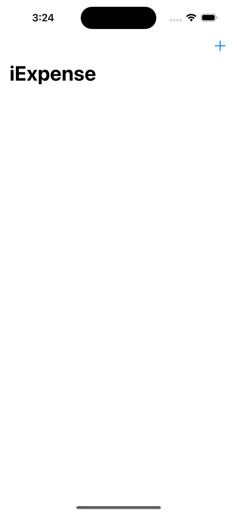
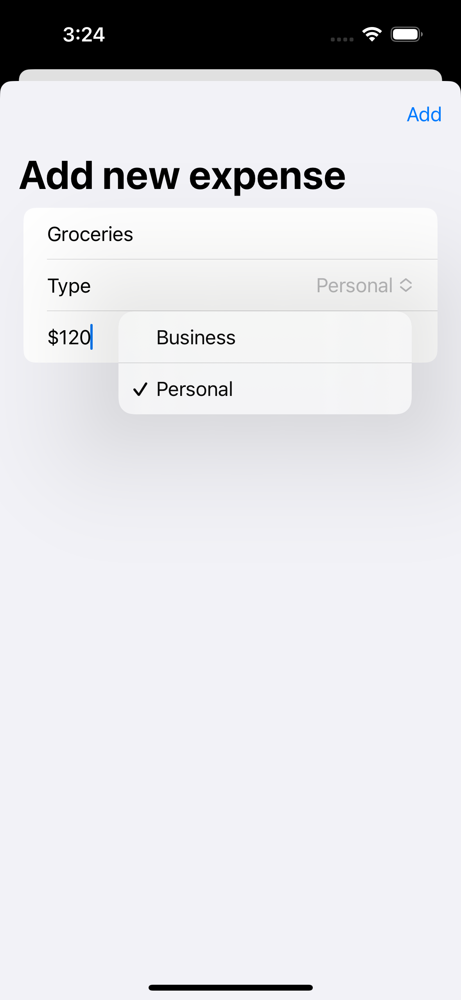
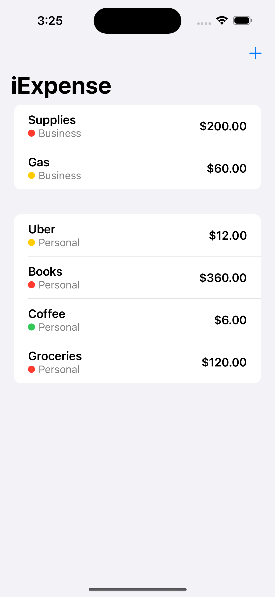

# iExpense App

Track your expenses effortlessly with iExpense, a sleek and intuitive expense tracking app built using SwiftUI.

## Features

- **Expense Categorization:** Organize your expenses into personal and business categories for better insights into your spending habits.

- **Color-Coded Indicators:** Expenses are color-coded for quick identification of their significance: red for high, yellow for medium, and green for low expenses.

- **User-Friendly Interface:** The app boasts a user-friendly design that provides a seamless experience for adding, viewing, and managing your expenses.

- **Quick Expense Addition:** Adding a new expense is a breeze—just tap the (+) button on the toolbar and fill in the details.

- **Effortless Deletion:** Swipe left on an expense to swiftly delete it from your list.

## Screenshots

  
  
  

## Installation

1. Clone this repository to your local machine.
2. Open the project in Xcode.
3. Build and run the app on the iOS simulator or your personal device.

## Requirements

- iOS 14.0+
- Xcode 12.0+
- Swift 5.0+

## Contributing

Contributions are welcome! If you find any bugs or have suggestions for new features, please open an issue or submit a pull request.

Built with ❤️ by Abu Sayeed Roni

Connect with me:
[LinkedIn](https://www.linkedin.com/in/roniabusayeed)
